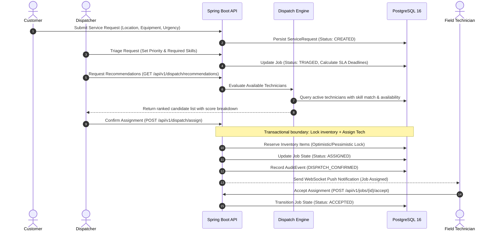

# FieldPulse: System Architecture & Design Specification

## 1. High-Level Architecture Overview

FieldPulse is designed as a modern, decoupled client-server platform optimized for high concurrency, real-time operational reactivity, and strong data consistency.

```
                  +----------------------------------------------+
                  |         Client Tier (React 18 + Vite)        |
                  |  - Dispatch Board (Leaflet Maps)             |
                  |  - Technician Mobile Portal                  |
                  |  - Operations KPI & SLA Dashboard            |
                  +-----------------------+----------------------+
                                          |
                      HTTPS (REST API)    |   WebSocket (STOMP)
                                          v
                  +----------------------------------------------+
                  |         Backend Tier (Spring Boot 3)         |
                  |  - Spring Security (Stateless JWT + RBAC)   |
                  |  - Dispatch Scoring Engine                   |
                  |  - Job Lifecycle State Machine Manager       |
                  |  - Inventory Reservation Coordinator         |
                  |  - SLA Monitoring & Escalation Scheduler     |
                  +---------------+--------------+---------------+
                                  |              |
                JPA / Hibernate   |              |  Lettuce Redis Client
                                  v              v
                  +---------------+---+  +-------+---------------+
                  |    PostgreSQL 16  |  |    Redis 7 Cluster    |
                  | (Relational Data, |  | (Session Cache, Lock, |
                  |  ACID Tx, Flyway) |  |  Pub/Sub for STOMP)  |
                  +-------------------+  +-----------------------+
```

---

## 2. Technology Stack Justification

| Layer | Selected Tech | Rationale & Tradeoffs |
| :--- | :--- | :--- |
| **Backend Core** | Java 21 + Spring Boot 3.3+ | Industry enterprise standard, virtual threads (Project Loom) for high-throughput I/O, robust ecosystem for validation, security, and scheduling. |
| **Database** | PostgreSQL 16 | ACID-compliant relational engine, robust JSONB support for audit payloads, spatial extension friendliness, strict isolation levels. |
| **Schema Migrations** | Flyway | Version-controlled, reproducible database migrations ensuring parity between local development, CI testcontainers, and production. |
| **In-Memory Store** | Redis 7 | Distributed caching for active technician locations, fast dispatch candidate filtering, distributed locking (Redisson) for parts reservation, and real-time STOMP messaging relay. |
| **Security** | Spring Security 6 + JWT | Stateless Bearer token authentication with access + refresh token rotation; strict method-level Role-Based Access Control (`@PreAuthorize`). |
| **Frontend Framework** | React 18 + TypeScript + Vite | Ultra-fast development feedback loop, end-to-end type safety, resilient component hierarchy, rich ecosystem for data visualization. |
| **UI & Styling** | Tailwind CSS + Lucide Icons | Utility-first styling for rapid design iteration, low bundle footprint, clean responsive layouts for desktop dispatch boards and mobile technician views. |
| **Maps & Geolocation** | Leaflet + OpenStreetMap | Lightweight, open-source mapping without proprietary API cost barriers or token quotas, ideal for interactive dispatch marker rendering. |
| **DevOps & Containers** | Docker + Docker Compose | One-command local environment bootstrapping (Postgres, Redis, Backend, Frontend); uniform CI/CD pipeline execution via GitHub Actions. |

---

## 3. Data Flow: The Dispatch & Reservation Lifecycle



---

## 4. Key Engineering Design Decisions

### 4.1 Transactional Inventory Reservation
To avoid double reservation under concurrent dispatch conditions:
- The system employs JPA pessimistic write locking (`@Lock(LockModeType.PESSIMISTIC_WRITE)`) on the `InventoryItem` stock row during reservation.
- Decrementing available stock and incrementing reserved stock occurs in the same `@Transactional` boundary as job state progression.
- If required stock is insufficient, the transaction throws `InsufficientInventoryException` and aborts assignment.

### 4.2 Distance Calculation via Haversine Formula
For lightweight real-time scoring without external paid routing APIs:
$$d = 2R \arcsin \left( \sqrt{\sin^2\left(\frac{\Delta \phi}{2}\right) + \cos(\phi_1)\cos(\phi_2)\sin^2\left(\frac{\Delta \lambda}{2}\right)} \right)$$
where $R \approx 6371 \text{ km}$, $\phi$ is latitude, and $\lambda$ is longitude. This allows the backend to rank proximity within milliseconds across hundreds of active technicians.

### 4.3 SLA Risk Polling & Notification Engine
A dedicated Spring `@Scheduled` background worker scans for active jobs:
- If `now() > sla_deadline - warning_buffer`, flag `sla_risk_level = WARNING` and broadcast an alert via WebSocket STOMP topic `/topic/sla-alerts`.
- If `now() > sla_deadline`, flag `sla_risk_level = BREACHED` and trigger escalation audit events.
- Redis idempotency keys prevent duplicate alert notifications from spamming dispatchers.
