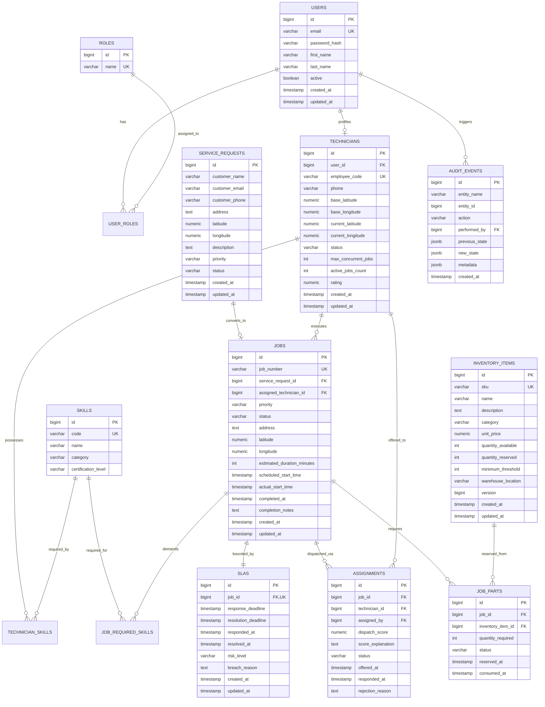

# OpsFlow: Database Design & Entity Relationship Specification

## 1. Executive Summary

The OpsFlow database schema is designed for high-concurrency field operations, multi-criteria dispatch optimization, transactional inventory tracking, and immutable audit logging. It enforces relational integrity through foreign keys, check constraints, and indexed lookup paths.

---

## 2. Entity-Relationship Diagram (ERD)

---

## 3. Indexing & Query Optimization Strategy

| Index Name | Table | Columns | Purpose |
| :--- | :--- | :--- | :--- |
| `idx_jobs_status_priority` | `jobs` | `(status, priority)` | Fast polling by dispatch engine & dashboard filtering |
| `idx_jobs_coords` | `jobs` | `(latitude, longitude)` | Geospatial bounding box proximity searches |
| `idx_technicians_status_coords` | `technicians` | `(status, current_latitude, current_longitude)` | Instant candidate filtering for available technicians |
| `idx_slas_risk_deadline` | `slas` | `(risk_level, resolution_deadline)` | 60-second scheduled background SLA breach worker |
| `idx_inventory_sku` | `inventory_items` | `(sku)` | Unique part identification and quick lookups |
| `idx_audit_entity` | `audit_events` | `(entity_name, entity_id)` | Fast chronological retrieval of entity history |

---

## 4. Concurrency & Integrity Invariants

1. **Inventory Stock Guarding**:
   - `quantity_available >= 0` check constraint.
   - `quantity_reserved >= 0` check constraint.
   - Optimistic locking via `version` column on `inventory_items` to prevent lost updates under parallel dispatch.
2. **Technician Capacity**:
   - `active_jobs_count <= max_concurrent_jobs`.
   - Prevent overlapping schedule windows for the same technician.
3. **Immutability of Audit Trail**:
   - `audit_events` is an insert-only table; no updates or deletes permitted.
